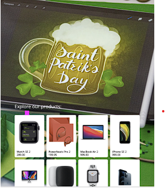

# Frontend
You have been provided with a basic Next.JS/React/Typescript application. Your task is to
display a list of products retrieved from the Shopify Storefront GraphQL API in a responsive
grid. A graphql codegen script has been included and can be invoked by running `yarn run
codegen`. You should continue to follow the object-oriented programming approach set out in
the initial project.

The requirements are as follows:
- The page should initially display 10 products
- When the user scrolls, and the end of the grid is reached, more products should be
loaded
- Each grid item should include a product picture, the product name, and its price
- When an item is selected (clicked), the details of that product should be displayed
(including the HTML description)
- The grid should be responsive, ideally to work nicely on desktop and mobile devices
- Do not write any mutations or modify any data in shopify. Queries only!
- Do not use a UI Framework.

An example design for the grid is provided below.

The purpose of this exercise is not to build the most aesthetically pleasing user interface, but to
demonstrate your qualities as a software engineer to produce a well architectured, easy to
extend, testable, frontend application .

## Hints
Try to take advantage of NextJS and Server Side Rendering
- Latest version of Chrome will be used for testing
- Responsivity can be tested with Chrome’s developer tools
- API Documentation: https://shopify.dev/docs/storefront-api/getting-started
- Use the following credentials for the API:
Shopify domain: dev-cloudshelf.myshopify.com
Storefront Token (Access Token): e78aab9ceb653dc9c6748c32da2bc114
- If you decide to build the backend, you can use your own API instead of Shopify’s to
fetch the products and their details. You will need to modify the codegen configuration to
support this.