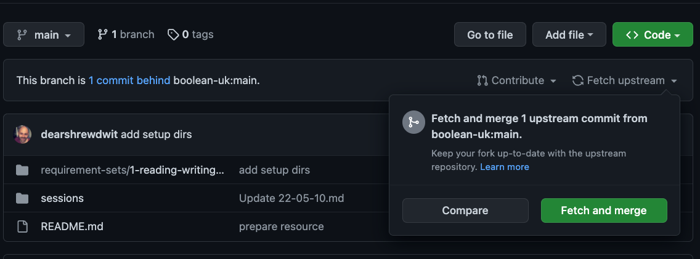
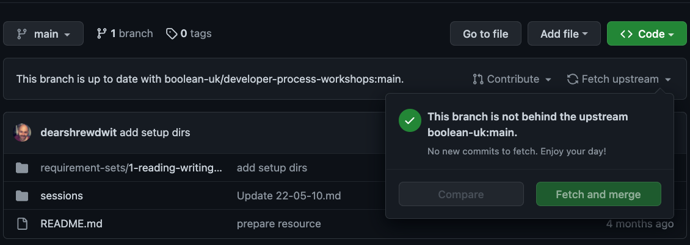

### Quickstart
Make sure you've forked and cloned the repository

### To get each new requirement set

1. [update your fork](https://docs.github.com/en/pull-requests/collaborating-with-pull-requests/working-with-forks/syncing-a-fork) with the upstream changes using the GitHub UI.
2. On your forked repo in GitHub, find the button Fectch upstream - any new requirements will be represented by at least 1 new commit.
3. Click the button Fetch and merge to merge the commits into your main branch in your fork
4. Update your local repo on your machine, by `git pull origin main`

Before merging:

After merging:

### To submit work

1. Go through the above process
2. Find the new requirement and do your work in that project directory.
3. When ready push your work to your fork
4. Open a PR back to the Boolean repo if it's your first requirement
5. Share a link to your PR in the issue for the current requirement!
